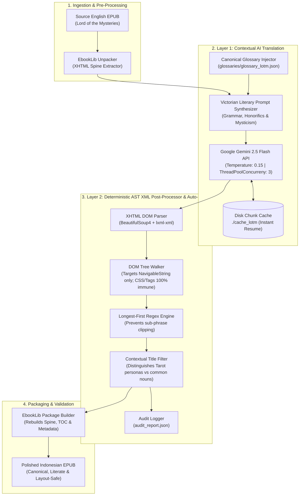

# 🔮 Lord of the Mysteries (LOTM) EPUB Translator

<div align="center">

[](LICENSE)
[](https://python.org)
[](https://ai.google.dev/)
[](https://www.crummy.com/software/BeautifulSoup/)
[](#-dual-layer-architecture)
[](https://www.w3.org/publishing/epub3/)

<p align="center">
  <b>A production-grade, specialized English-to-Indonesian EPUB novel translator engineered specifically for "Lord of the Mysteries" (诡秘之主). Features a Dual-Layer Defense Architecture combining temperature-locked Gemini LLM contextual translation with deterministic AST XML DOM post-processing and auto-repair.</b>
</p>

[Key Capabilities](#-key-capabilities) • [System Architecture](#-dual-layer-architecture) • [CLI Reference](#-cli-command-reference) • [Glossary Engine](#-canonical-glossary-dataset) • [Quick Start](#-quick-start) • [Troubleshooting](#-troubleshooting--faq) • [License](#-license)

</div>

---

## 📖 Executive Summary

Translating high-fantasy web novels like Cuttlefish That Loves Diving's ***Lord of the Mysteries*** (*Kuil Penguasa Misteri*) using generic machine translation (Google Translate, DeepL, or zero-shot LLM prompts) leads to catastrophic readability degradation:
- **Canonical Term Degradation**: Sacred organizations and titles are translated literally (e.g. *"Nighthawks"* mangled into *"Elang Malam"*, *"Tarot Club"* into *"Klub Tarot"*, or *"Sealed Artifact"* into *"Artefak Tersegel"*).
- **Tarot Persona vs. Common Noun Collisions**: Naive translation replaces common words (e.g. *"dunia"*, *"bulan"*, *"matahari"*, *"bintang"*) with Tarot code names (*"The World"*, *"The Moon"*, *"The Sun"*, *"The Star"*), confusing narrative context.
- **XHTML Tag & CSS Corruption**: Standard string replacement breaks internal EPUB markup, splitting closing XML tags and corrupting reading layouts.

**LOTM EPUB Translator** eliminates these pitfalls through an intelligent **Dual-Layer Defense System**:
1. **Layer 1 (Contextual AI Translation)**: Employs Google Gemini with Victorian literary prompts, dataset glossary injection, and deterministic temperature (`0.15`) for faithful world-building.
2. **Layer 2 (Deterministic AST XML Auto-Repair)**: Directly traverses the EPUB XHTML DOM using BeautifulSoup (`lxml-xml`), strictly targeting `NavigableString` nodes with a longest-first regex matcher and contextual disambiguation filters.

---

## 🛡️ Dual-Layer Architecture



---

## ✨ Key Capabilities

### 1. Dual-Layer Defense Strategy
Combines the nuanced fluid prose of state-of-the-art LLMs with the zero-hallucination guarantee of rule-based compiler AST parsers. Even if the LLM forgets a term or mistranslates an honorific name, Layer 2 deterministically catches and rectifies it before the EPUB is repacked.

### 2. Zero-Corruption AST XML DOM Manipulation
Traditional string replacement (`text.replace()`) inevitably mangles attributes like `<span class="italic">` or breaks XML entities. Layer 2 parses documents into a formal Abstract Syntax Tree (AST), modifying **only text nodes (`NavigableString`)**. All HTML tags, inline styles, CSS classes, image references, and spine structures remain 100% pristine.

### 3. Longest-First Regex Substitution
When replacing terminology, shorter words can corrupt longer compound names (e.g. replacing *"Artifact"* before *"Sealed Artifact 0-08"*). Our engine sorts canonical phrases by character length in descending order, ensuring multi-word terms are matched atomically.

### 4. Contextual Tarot Title Disambiguator
Tarot Club code names (*"The Fool"*, *"The World"*, *"The Magician"*, *"Justice"*, *"The Sun"*) are also everyday Indonesian words (*"si bodoh"*, *"dunia"*, *"pesulap"*, *"keadilan"*, *"matahari"*). The post-processor analyzes neighboring tokens and capitalization patterns to guarantee that Tarot member titles are preserved as personas without damaging normal descriptive sentences.

### 5. Resumable Chunk Caching (`--cache-dir`)
Chapter translations are hashed and cached to disk. If your internet disconnects, the API encounters rate limits, or the process is interrupted, re-running the command resumes immediately from the exact paragraph where it stopped without consuming duplicate tokens.

### 6. Standalone Auto-Repair Mode (`--repair-only`)
Already have an existing English-Indonesian machine-translated EPUB? Run `--repair-only` to execute Layer 2 independently. The tool fixes thousands of broken names, pathways, and honorific phrases in seconds **without calling the Gemini API or spending a single credit**.

---

## 💻 CLI Command Reference

`main.py` provides a full-featured CLI interface:

```bash
python main.py [OPTIONS]
```

| Flag | Type | Default | Description |
| :--- | :--- | :--- | :--- |
| `-i`, `--input` | `Path` | **Required** | Path to the source EPUB file (English or unpolished Indonesian). |
| `-o`, `--output` | `Path` | `None` | Path for the output translated/repaired EPUB. |
| `-g`, `--glossary` | `Path` | `glossaries/glossary_lotm.json` | Path to canonical terminology glossary database. |
| `-c`, `--concurrency` | `int` | `3` | Number of parallel worker threads for LLM requests. |
| `-t`, `--temperature` | `float` | `0.15` | Model generation temperature (low value ensures high rule adherence). |
| `-m`, `--model` | `str` | `gemini-2.5-flash` | Gemini model tag (`gemini-2.5-flash`, `gemini-2.0-flash`). |
| `--cache-dir` | `Path` | `./cache_lotm` | Directory where translated chapter chunks are cached for instant resume. |
| `--repair-only` | `Flag` | `False` | Run **Layer 2 only** (XHTML DOM repair) without invoking LLM APIs. |
| `--skip-post-process` | `Flag` | `False` | Skip Layer 2 (generate raw AI output only). |
| `--audit-log` | `Path` | `audit_report.json` | Path where term replacement audit statistics are saved. |
| `--api-key` | `str` | `None` | Gemini API key (overrides `.env` variable). |

---

## 📚 Canonical Glossary Dataset

Stored in `glossaries/glossary_lotm.json`, covering hundreds of vetted terms across all 22 pathways:

| Category | Canonical English Term | Canonical Indonesian Translation |
| :--- | :--- | :--- |
| **Pathways & Sequences** | *Seer Pathway* | Jalur Seer |
| | *Sequence 9: Seer* | Urutan 9: Seer |
| | *Sequence 8: Clown* | Urutan 8: Clown |
| | *Sequence 7: Magician* | Urutan 7: Magician |
| | *Sequence 4: Bizarro Sorcerer* | Urutan 4: Bizarro Sorcerer |
| **Factions & Organizations**| *Tarot Club* | Tarot Club |
| | *Nighthawks* | Nighthawks |
| | *Mandated Punishers* | Mandated Punishers |
| | *Machinery Hivemind* | Machinery Hivemind |
| | *Aurora Order* | Aurora Order |
| **Tarot Club Personas** | *The Fool* | The Fool |
| | *The World* | The World |
| | *Justice* | Justice |
| | *The Hanged Man* | The Hanged Man |
| **Mysticism Concepts** | *Beyonder* | Beyonder |
| | *Sealed Artifact* | Sealed Artifact |
| | *Acting Method* | Acting Method |
| | *Spirit World* | Dunia Roh |
| | *Astral Projection* | Proyeksi Astral |
| **Honorific Names** | *The Fool that doesn't belong to this era...* | *The Fool yang bukan berasal dari era ini...* |

---

## 🛠️ Tech Stack

| Domain | Library / Tool | Version | Purpose |
| :--- | :--- | :--- | :--- |
| **Language** | [Python](https://python.org/) | `>=3.10` | Core programming language |
| **LLM Gateway** | [google-genai / openai](https://github.com/google/generative-ai-python) | `>=0.1.1` | Gemini API communication with retry backoff |
| **EPUB Manipulation** | [EbookLib](https://github.com/aerkalov/ebooklib) | `>=0.18` | EPUB container unpacking, item reading, repacking |
| **DOM Parsing** | [BeautifulSoup4](https://www.crummy.com/software/BeautifulSoup/) | `>=4.12` | NavigableString extraction and XHTML AST traversal |
| **XML Parser Engine** | [lxml](https://lxml.de/) | `>=5.0` | High-performance XML/HTML backend for BeautifulSoup |
| **JSON Recovery** | [json-repair](https://github.com/mangiucugna/json_repair) | `>=0.25` | Fault-tolerant repair of truncated LLM responses |
| **Progress Tracker** | [tqdm](https://github.com/tqdm/tqdm) | `>=4.66` | CLI interactive progress meter |
| **Environment** | [python-dotenv](https://github.com/theskumar/python-dotenv) | `>=1.0` | Secure environment variable management |

---

## 🚀 Quick Start

### 1. Prerequisites
- **Python**: Version `3.10` or higher (`python --version`)
- **Google Gemini API Key**: [Get a free key from Google AI Studio](https://aistudio.google.com/)

### 2. Installation
```bash
git clone https://github.com/stenlysayd/lotm_epub_translator.git
cd lotm_epub_translator
python -m venv venv

# Windows
venv\Scripts\activate

# Linux / macOS
source venv/bin/activate

pip install -r requirements.txt
```

### 3. Environment Setup
```bash
cp .env.example .env
```
Edit `.env` and set your API key:
```env
GEMINI_API_KEY=AIzaSy...
```

### 4. Run Full Translation (Layer 1 + Layer 2)
```bash
python main.py -i "novels/LOTM_Vol1_English.epub" -o "novels/LOTM_Vol1_Indonesian.epub"
```

### 5. Run Repair-Only Mode (Zero Cost)
Fix names and layout in an already-translated EPUB in seconds:
```bash
python main.py -i "novels/LOTM_Draft.epub" -o "novels/LOTM_Repaired.epub" --repair-only
```

---

## 📁 Repository Structure

```text
lotm_epub_translator/
├── main.py                     # Main CLI command interface and runner
├── requirements.txt            # Production Python dependencies
├── .env.example                # Documented configuration template
├── .gitignore                  # Excludes .env, large EPUBs, and cache folders
├── LICENSE                     # MIT License
├── lotm/                       # Core engine package
│   ├── __init__.py             # Module initialization
│   ├── config.py               # Longest-first rules, prompts, and normalization maps
│   ├── core.py                 # Gemini API integration and batch orchestrator
│   └── post_processor.py       # BeautifulSoup AST XML tree parser and auto-repair
├── glossaries/                 # Curated canonical term databases
│   └── glossary_lotm.json      # Complete LOTM pathways, factions, and artifact database
├── tools/                      # Ancillary utility scripts
│   ├── extract_terms.py        # Automatic term extractor for newly released chapters
│   └── repair_cache.py         # Offline batch cache modifier and repair tool
└── tests/                      # Unit test suite
    └── test_repair.py          # Regression tests for XML AST preservation and disambiguation
```

---

## 🔧 Troubleshooting & FAQ

| Symptom / Error | Root Cause | Exact Resolution |
| :--- | :--- | :--- |
| `ResourceExhausted / 429 Rate Limit` | Gemini API per-minute quota exceeded | Reduce concurrency: `python main.py -c 2` or use paid tier key |
| `FileNotFoundError: input.epub` | Invalid relative or absolute path | Verify path enclosed in quotation marks: `-i "C:\path\to\novel.epub"` |
| `XMLSyntaxError: Opening and ending tag mismatch` | Malformed source EPUB XHTML | Layer 2 repairs this automatically using `lxml-xml` parser |
| `Interrupted translation process` | Network loss or power interruption | Re-run identical command; `--cache-dir` resumes with zero token waste |

### Frequently Asked Questions

**Q: Does Layer 2 consume Gemini API tokens?**  
A: No! Layer 2 is a purely local, deterministic AST regex algorithm. Running `--repair-only` costs 0 tokens and completes in 2–5 seconds per volume.

**Q: Can I add custom terminology or character names?**  
A: Yes! Simply add your term pair to `glossaries/glossary_lotm.json` or pass a custom glossary file with `-g path/to/my_glossary.json`.

**Q: Will this destroy custom fonts or chapter images?**  
A: Never. Because the engine operates on BeautifulSoup's `NavigableString` nodes, all image tags (``), CSS stylesheets, and EPUB container manifests remain identical to the original book.

---

## 🔒 Privacy & Security

- **Local EPUB Files**: Your input and output EPUB files remain strictly on your local machine and are never uploaded to remote servers.
- **Git-Ignored Cache**: `./cache_lotm/`, `novels/`, and `.env` are protected in `.gitignore` to prevent secret leaks and copyright infringement.
- **Key Safety**: API keys are loaded via `python-dotenv` from local environment variables.

---

## 🤝 Contributing

Pull requests to expand terminology coverage or optimize AST repair performance are welcome!
1. Fork this repository.
2. Create a feature branch (`git checkout -b feature/pathway-terms`).
3. Commit your updates (`git commit -m 'feat: add Circle of Inevitability pathway terms'`).
4. Push to branch and submit a PR.

---

## 📄 License

Distributed under the **[MIT License](LICENSE)**.

---

<div align="center">

Crafted with 🔮 by **[Stenly Sayd](https://github.com/stenlysayd)**

</div>
